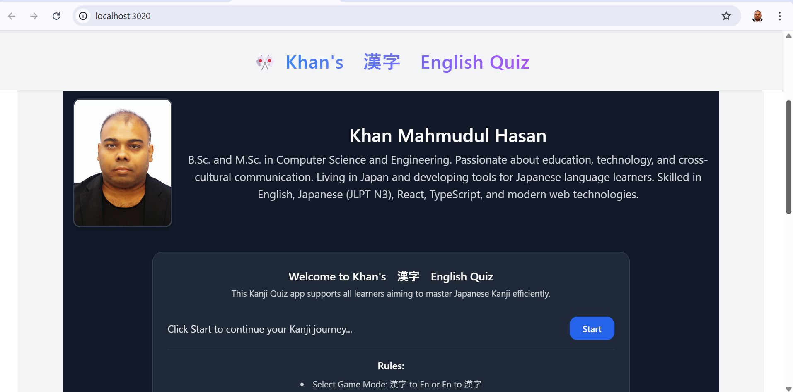

# Khan's Kanji English Practice

A modern, interactive Kanji-English quiz app built with React, TypeScript, Tailwind CSS, and Framer Motion — designed to support learners of the Japanese language through intuitive and accessible gameplay.

---

## 🌟 About the Project

This app offers a clean, responsive interface for users to practice Japanese Kanji and their English meanings. It supports multiple JLPT levels (N5–N1), customizable game modes, and a scoring system to encourage learning through positive feedback.

### 🔑 Features

- 🇯🇵 Quiz Modes: En ➜ 漢字 and 漢字 ➜ En
- 🎯 JLPT Levels: Choose N5 to N1 or mix all levels
- ⏱️ Time-bound play for focused practice
- ✅ Intelligent scoring: Correct (+), Wrong (−), Skipped (neutral)
- ⚙️ Built with React, TypeScript, Tailwind, and Framer Motion
- 📊 Excel-based Kanji data loader (via XLSX parser)

---

## 📁 Kanji Excel Files

### `/public/docs`

This directory contains the Excel files for JLPT Kanji levels (N5 to N1), which are used by the `KanjiLoader` hook to dynamically load and parse quiz content. Each file follows a consistent structure for reliable use within the app.

---

## 📸 Preview



---

## 🧑‍💻 Developer Profile

### Khan Mahmudul Hasan

A dedicated software engineer based in **Japan**, holding a **B.Sc. and M.Sc. in Computer Science and Engineering**. Fluent in **English**, conversational in **Japanese (JLPT N3)**, and actively involved in building tools that bridge cultures through language and technology.

### 🧠 Tech Skills

- **Frontend**: React, TypeScript, Tailwind CSS, Bootstrap, Framer Motion
- **Backend**: Spring Boot, Laravel, PHP, Node.js
- **Languages**: Java, JavaScript, TypeScript, Python, SQL, HTML/CSS
- **Tools**: Git, GitHub, Vite, Figma, VS Code, Postman
- **Databases**: PostgreSQL, MySQL, SQLite

---

## 🤝 Collaboration & Career Vision

Khan aspires to contribute to projects that:
- Promote **language learning**, **cultural exchange**, and **education**
- Align with **Japanese business ethics** and **quality standards**
- Allow **remote, freelance, or part-time flexibility** while working with innovative teams

Currently open to:
- 🧩 Freelance frontend projects
- 👨‍🏫 Part-time teaching or EdTech opportunities
- 🌐 Cross-cultural tech collaborations

📄 For Japanese readers (日本語):
- Khanは現在、ReactやTypeScriptを使ったアプリ開発に注力しており、日本文化と言語に深い興味を持っています。
- 教育関連のプロジェクトや、英語・日本語対応のソフトウェア開発などの協力機会を歓迎します。

---

## 📬 Contact

- 🌐 [LinkedIn](https://www.linkedin.com/in/mahmudulcse/)
- 🐙 [GitHub](https://github.com/csemahmud)
- 📘 [Facebook](https://www.facebook.com/cse.mahmud)
- 📧 Email: lone.wolf.mahmud@gmail.com
- 📞 Japan: +81-70-4381-4193

---
🔗 [Live Demo](https://csemahmud.github.io/khans_kanji_english_practice/)
---

## 🛠️ How to Run Locally

1. **Clone the repository:**
   ```bash
   git clone https://github.com/csemahmud/khans_kanji_english_practice.git
   cd khans_kanji_english_practice

2. **Install dependencies:**
   ```bash
   npm install --legacy-peer-deps

3. **Run the development server:**
   ```bash
   npm run dev --host

4. **Access in browser:**
   http://localhost:3020/

Developed with care and purpose by
Khan Mahmudul Hasan
Nagoya, Japan

#jlpt, #kanji, #quiz, #language-learning, #react-app